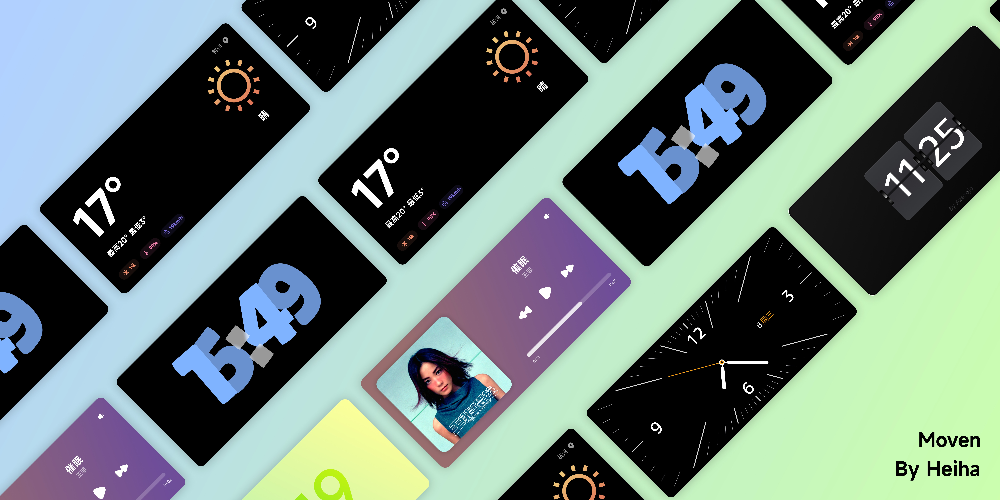

# Moven

⚡️一款待机显示App
🌈支持精美的⌚️时钟、☁️天气、🎵音乐等组件, 让你的手机成为绝美的桌面摆件

👇**下载链接**

- [123网盘](https://www.123pan.com/s/QXoajv-3meQH.html)

### 更新记录

#### [2023.12.19 - v1.2.alpha](https://www.123pan.com/s/QXoajv-3meQH.html)

- 新增分屏支持, 可左右分别展示不同的组件
- 新增对Android小部件的支持
- 新增一个半屏的时钟组件
- 新增一个半屏的天气组件
- 修复长时间运行时间不准确的bug
- 修复组件偶现无法添加的bug
- 优化长按动画

#### [2023.12.8 - v1.1.alpha](https://www.123pan.com/s/QXoajv-PHeQH.html)

- 新增记忆最后使用组件功能: 离开并杀死应用后, 再次打开会恢复到上次使用的组件

- 修复Android9上, 「Moven」没有全屏显示, 展示白色状态栏的问题
- 修复熄屏状态下会隔一段时间闪回锁屏界面的问题
- 修复冷启动闪烁的问题
- 修复霓虹灯时钟偶现消失的问题

#### [2023.12.5 - v1.0.alpha](https://www.123pan.com/s/QXoajv-8heQH.html)

- 支持5款时钟组件、1款天气组件和1款音乐组件
  - 时钟组件
    - QQ时钟: 以Q弹的动画展示时间
    - 渐变时钟: 渐变背景, 镂空文字
    - 翻页时钟: 谁的桌面能缺少一个翻页时钟呢?
    - 经典时钟: 复古经典的刻度时钟样式
    - 霓虹灯时钟: 霓虹灯在闪烁, 时间在流逝
  - 天气: 展示当天和实时的天气状况
  - 音乐: 展示当前播放的专辑和歌曲, 控制音乐的进度.
- 支持自动启动: 根据充电、熄屏和横屏等状态自动启动「Moven」
- 防烧屏: 通过平移像素来防止烧屏, OLED屏幕必备

### 功能规划

https://github.com/users/heiha100/projects/1/views/1

### Bug和功能反馈

https://github.com/heiha100/Moven/issues

### 联系作者

- 社交账号: [小红书](https://www.xiaohongshu.com/user/profile/63d0ff6d000000002702bae1?xhsshare=WeixinSession&appuid=63d0ff6d000000002702bae1&apptime=1701765245)
- 邮箱: heiha100@outlook.com

------

[❤️**请作者喝一杯蜜雪冰城**](https://afdian.net/a/moven)

